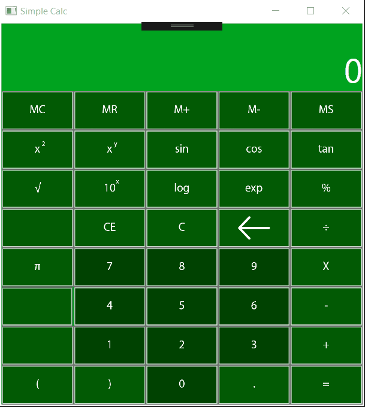

# Basic WPF Scientific Calc

A humble calculator app similar to the default one in Windows 10 built using WPF in Visual Studio 2019 with C# and the .Net framework.

## Motivation

I created this small project with three objectives:

1. Gain experience with creating a gui-based program utilizing WPF.
2. Write some (basic, non-exhaustive) unit tests to run against a C# program as I developed it.
3. Become more accustomed to using Visual Studio 2019 as a development environment.

In its current state, the project is fairly unpolished and there are a few obscure bugs waiting to be found (mostly dealing with keyboard input). I have already achieved the goals I wanted from it, so I do not intend to develop further.

## Screenshots




## Usage

#### Clone the Repo:

```shell
git clone https://github.com/cplant1776/scientific-calc.git
```

#### Running

##### Using Visual studio

Simply open the solution, build it and run.

##### As a .exe
Run the executable found at **\ScientificCalc\bin\Release\ScientificCalc.exe**

